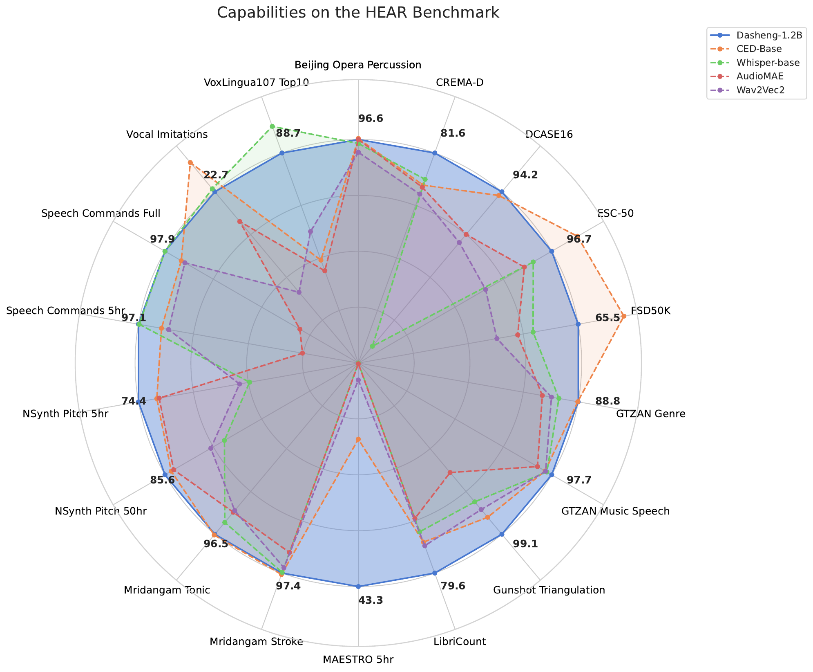

<div align="center">
    <h1>
    Dasheng (大声)
    </h1>
    <p>
    Official PyTorch code for <b>D</b>eep <b>A</b>udio-<b>S</b>ignal <b>H</b>olistic <b>E</b>mbeddi<b>ng</b>s <br>
    <b><em>Scaling up masked audio encoder learning for general audio classification</em></b>
    </p>
    </p>
    <a href="https://arxiv.org/abs/2406.06992"></a>
    <a href="https://github.com/richermans/dasheng"></a>
    <a href="https://www.python.org"></a>
    <a href="https://pytorch.org"></a>
    <a href="https://www.apache.org/licenses/LICENSE-2.0"></a>
</div>

# TL;DR

```bash
python3 -m pip install dasheng
python3 -c "from dasheng import dasheng_base; import torch; model = dasheng_base().eval(); features=model(torch.randn(1, 16000))"
```


This repo provides checkpoints for the Interspeech 2024 paper [Scaling up masked audio encoder learning for general audio classification](https://arxiv.org/abs/2406.06992).
The goal of this work is to investigate the scalability of masked autoencoders for audio.
Prior work did not scale beyond 10,000 hours of audio, while Dasheng used 272,000 hours of training data.


## Huggingface 🤗


<div align="left">
    <a href="https://huggingface.co/mispeech/dasheng-base"></a>
    <a href="https://huggingface.co/mispeech/dasheng-0.6B"></a>
    <a href="https://huggingface.co/mispeech/dasheng-1.2B"></a>
</div>

Please see [here](https://huggingface.co/mispeech/dasheng-base) for usage instructions.


# Models

Dasheng models have been trained on 272k hours of general audio, mainly [VGGSound](https://www.robots.ox.ac.uk/~vgg/data/vggsound/), [Audioset](https://research.google.com/audioset/), [MTG-Jamendo](https://mtg.github.io/mtg-jamendo-dataset/) and [ACAV100M](https://acav100m.github.io/).

Models with their evaluation results on the [HEAR benchmark](https://hearbenchmark.com/), averaged across different domains.

| Model | Parameters (M) | Environment Sounds | Speech  | Music |
|------|-------|-------|-------| ------ |
| Dasheng-Base| 86   | 80.2 | 72.5 | 84.0 |
|Dasheng-0.6B | 600    | 82.4 | 74.9 | 84.0 |
| Dasheng-1.2B | 1200    | **83.2** | **75.7** | **84.9** |
| [AudioMAE](https://github.com/facebookresearch/AudioMAE) | 86 | 61.7 | 38.7 | 72.7 |
| [Whisper-Base-V1](https://github.com/openai/whisper) | 74 | 52.5 | 73.1 | 69.1 |
| [WavLM-Large](https://github.com/microsoft/unilm/tree/master/wavlm) |  330 | 71.4 |  72.2 | 65.0 |
| [Wav2vec-large-100k-voxpopuli](https://huggingface.co/facebook/wav2vec2-large-100k-voxpopuli) | 300 | 62.5 | 63.6 | 69.5 |
| [Data2Vec-Audio-Large](https://huggingface.co/facebook/data2vec-audio-large) | 300 |41.1 |  60.5 | 55.0 |



## K-Nearest Neighbor results

Performance of features without parameterized training.

|                          | ESC50 | FSDKaggle18 | NSynth Instrument | Speech Commands 1  | Speech Commands 2   | US8k  | VoxCeleb1 | RAVDESS-Speech | FluentSpeechCommands   |
|--------------------------|-------|--------|-------------|-------|-------|-------|-----------|---------|-------|
| [MSM-MAE](https://github.com/nttcslab/msm-mae) | 2     | 2.18   | 20.58       | 3.7   | 1.5   | 11.5  | 0.12      | 6.77    | 1.85  |
| MelSpec                  | 18.4  | 38.5   | 35.5        | 3.7   | 1.5   | 40.39 | 5.26      | 29.65   | 9.97  |
| [CED-Base](https://github.com/RicherMans/CED)                      | 95.35 | 85.06  | 74.41       | 79.78 | 62.66 | 87.06 | 7.02      | 52.78   | 16.61 |
| [AudioMAE](https://github.com/facebookresearch/AudioMAE) | 53.05 | 43.38  | 67.21       | 56.87 | 5.9   | 58.18 | 2.9       | 28.68   | 7.59  |
| [WavLM-Large](https://github.com/microsoft/unilm/tree/master/wavlm) | 51.3  | 60.87  |             | 96.97 | 92.69 | 58.67 | 28.54     | 51.39   | 83.28 |
| [Wav2vec-large-100k-voxpopuli](https://huggingface.co/facebook/wav2vec2-large-100k-voxpopuli) | 44    | 59.5   | 60.42       | 80.86 | 66.61 | 59.84 | 18.22     | 45.76   | 30.48 |
| Dasheng-Base             | 61.9  | 70.31  | 70.02       | 93.55 | 86    | 73.87 | 34.21     | 58.12   | 52.33 |
| Dasheng-0.6B             | 66.55 | 72.06  | 70.87       | 93.36 | 87.27 | 75.92 | 37.78     | 61.81   | 57.63 |
| Dasheng-1.2B             | 68.55 | 72.06  | 71.19       | 95.9  | 90.9  | 77.71 | 39.39     | 61.94   | 62.38 |

## 1. Installation (Recommended for inference)

Install the package.

```bash
python3 -m pip install dasheng
```

### 1.2 Installation for Training

```bash
python3 -m pip install dasheng[train]
```

## 2. Usage

```python
# The three models of the paper
from dasheng import dasheng_base, dasheng_06B, dasheng_12B

model = dasheng_base()
```

Forward some audio data (note should be 16khz)

```python
import torch
model = model.eval()
features = model(torch.randn(1, 16000))
print(features.shape)
```

## 3. Training

Install dependencies:

```bash
python3 -m pip install dasheng[train]
```

### 3.1 Prepare data

We rely on the excellent [webdataset](https://github.com/webdataset) library for I/O.
Thus one simply needs to pack their data into a bunch of `.tar` files.

A simple example of such a file would be:

```bash
find DIR -type f -name '*flac' |  tar -rvf data.tgz -T -
```

We also provide a simple script [wavlist_to_tar] that automates this process, which is installed with the package.

```bash
wavlist_to_tar your_data.tsv shards/
```

Creating `your_data.tsv` is simple:

```bash
find data -type f  | awk 'BEGIN{print "filename"} {print}' > your_data.tsv
```

### 3.2 Training from source

To train one should first adjust the config in `dasheng/train/config/*yaml` accordingly, by adding their training data.

```bash
python3 dasheng/train/train.py dasheng/train/config/dasheng_base.yaml
```

MultiGPU support is realized using [Accelerate](https://huggingface.co/docs/accelerate/index)

```bash
accelerate launch --mixed_precision='bf16' dasheng/train/train.py dasheng/train/config/dasheng_base.yaml
```

## FAQ

### Is there an Audioset-finetuned Dasheng?

Yes, the performance for the base model is 49.7 mAP. One can use it as follows:

```python
from typing import Any, Mapping
import dasheng
import torch

class DashengAudiosetClassifier(torch.nn.Module):

    def __init__(self) -> None:
        super().__init__()
        self.dashengmodel = dasheng.dasheng_base()
        self.classifier = torch.nn.Sequential(torch.nn.LayerNorm(self.dashengmodel.embed_dim), torch.nn.Linear(self.dashengmodel.embed_dim, 527))

    def load_state_dict(self, state_dict: Mapping[str, Any], strict: bool = True, assign: bool = False):
        self.dashengmodel.load_state_dict(state_dict, strict=False)
        for_classifier_dict = {}
        for k,v in state_dict.items():
            if 'outputlayer' in k:
                for_classifier_dict[k.replace('outputlayer.','')]  = v
        self.classifier.load_state_dict(for_classifier_dict)
        return self

    def forward(self, x):
        x = self.dashengmodel(x).mean(1)
        return self.classifier(x).sigmoid()


mdl = DashengAudiosetClassifier()
check = torch.hub.load_state_dict_from_url('https://zenodo.org/records/13315686/files/dasheng_audioset_mAP497.pt?download=1',map_location='cpu')
mdl.load_state_dict(check)

prediction = mdl(torch.randn(1,16000))
```


## Citation

```bibtex
@inproceedings{dinkel2024dasheng,
  title={Scaling up masked audio encoder learning for general audio classification},
  author={Dinkel, Heinrich and Yan, Zhiyong and Wang, Yongqing and Zhang, Junbo and Wang, Yujun and Wang, Bin},
  booktitle={Interspeech 2024},
  year={2024}
}
```
